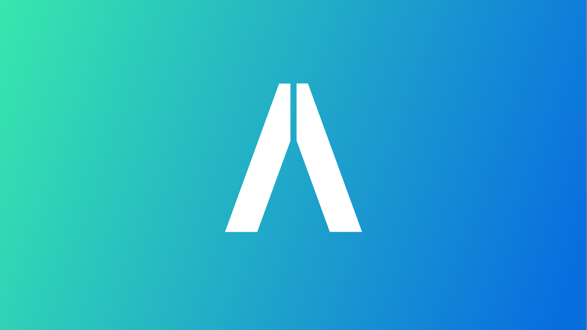

# 🫂 Introduction & Overview

<figure>
    
    <figcaption>Atlaspad Logo</figcaption>
</figure>

## <mark class="highlight">Introduction</mark>

Cryptocurrencies, decentralized financial systems, and blockchain technology have garnered significant attention in recent years, paving the way for financial innovation. AtlasPad aims to encourage greater participation in this fascinating world and make the crypto sphere more accessible. Our project is dedicated to contributing to the crypto ecosystem and providing entrepreneurs with financial access.

Entrepreneurs, whether they are running small startups or larger businesses, often face challenges related to capital. Working capital is a fundamental component required for establishing or expanding a business, and raising capital can be a significant challenge for entrepreneurs. There are various ways to secure venture capital, each with its own set of difficulties. These methods include using personal savings, borrowing from banks, or utilizing crowdfunding.

Nevertheless, traditional crowdfunding still comes with some disadvantages. These drawbacks include the lack of an obligation for entrepreneurs to deliver products to investors. Furthermore, selling stocks or other financial products obtained through crowdfunding on secondary markets can be complex, and there is no guarantee of fund returns. On the other hand, modern crowdfunding based on Web 3.0 presents its own set of challenges. These challenges encompass the need for significant capital, a lower probability of generating passive income, and the possibility of a project team departing after obtaining funding.

AtlasPad offers a decentralized crowdfunding ecosystem for Web 3.0 projects. AtlasPad seeks to address the drawbacks of both traditional and modern crowdfunding, providing a unique approach. Notable features of AtlasPad include low capital requirements, opportunities for passive income, investor protection mechanisms, and the possibility of capital reimbursement in cases of project failure or non-compliance with criteria.

AtlasPad's distinctive features are designed to make contributions to the crypto ecosystem and offer more opportunities to entrepreneurs. We aim to establish a leading position in the crowdfunding platforms market by contributing to financial innovation in the crypto world.

## <mark class="highlight">Why This Project?</mark>

The crypto ecosystem holds significant potential as an alternative to traditional financial systems. However, realizing this potential comes with various challenges. AtlasPad aims to overcome these challenges and offers its users an easier way to benefit from the advantages of the crypto world. Our project stands out with its transparent business model and user-centric design.

### <mark class="highlight">AtlasPad: Project Vision and Differentiators</mark> 

AtlasPad's vision and prominent differentiators are as follows:

User-Friendly Tools: AtlasPad provides user-friendly tools for users who want to manage their crypto assets. A user-friendly interface and integrated analytical tools help investors of all levels manage their crypto assets more effectively.

Leadership Board: The project offers investors a leadership board that showcases their achievements. This incentivizes investors, increases competition, and encourages more participants to get involved in the project.

Mobile App-Supported Launchpad: The mobile app enables users to manage their crypto assets from anywhere, at any time. Access via mobile devices makes participation in the crypto world more convenient.

Vesting Tracking System: AtlasPad provides a system for investors to track token vesting periods. This allows investors to manage their tokens more effectively.

Refund Policy and Cex Listing Requirement: Our project provides a refund policy to protect investors and also makes Cex listing mandatory for projects. This enhances reliability and protects investors from fraud.

Problem Statement: The financing and launch processes of crypto projects, despite experiencing significant growth and attention in recent years, are fraught with complexities. These complexities represent the fundamental challenges that crypto projects face, and they pose a serious obstacle to the sustainability and growth of the crypto ecosystem. Below, we provide a detailed analysis of these complexities.

Summary of the Problem: The financing and launch processes of crypto projects not only differ from traditional financing models but are also inherently complex and risky. Particularly for new and innovative projects, managing these processes can be highly challenging. Projects encounter a series of difficulties when presenting their tokens and visions to investors, and these challenges can adversely affect the successful financing and launch of projects.

Challenges: The main challenges that crypto projects face in their financing and launch processes are as follows:

High Funding Threshold: Crypto projects often require high capital for financing. This creates a significant barrier for small or new projects, making it difficult for them to start or grow.

Difficulty Accessing Investors: Similar to traditional financing models, gaining access to suitable investors for crypto projects can be a challenging process. Project owners must overcome difficulties in finding, convincing, and attracting potential investors.

Transparency Issues: The financing processes of crypto projects often encounter transparency issues. Investors are at risk when they lack sufficient information about a project's business model, the use of funds, and token distribution. This lack of transparency can damage trust.

Importance of the Problem: It is essential to emphasize the significance of these issues for the crypto community and industry. The challenges in the financing and launch processes of crypto projects are fundamental factors that influence the growth and evolution of the crypto ecosystem. Below, we highlight why these issues are of critical importance to the crypto community and industry:

### <mark style="highlight">Importance for the Crypto Community</mark> 

1. **More Innovation and Diversity:** More accessible and transparent financing models for the funding and launch of crypto projects encourage the emergence of new and innovative projects. This results in greater diversity and innovation within the crypto ecosystem. With more projects focusing on different use cases and industries, the crypto community can develop a richer ecosystem.
2. **More Investment Opportunities:** Improving the financing processes of crypto projects provides more opportunities for investors. This is crucial for investors who want to diversify their crypto assets. It can also encourage more people to participate in the crypto ecosystem.
3. **Building Trust and Reputation:** Transparent and effective financing processes enhance the credibility and reputation of projects. Increased trust in crypto projects encourages more investors and users to join the ecosystem. This contributes to the growth and development of the crypto community.

### <mark class="highlight">Importance for the Industry

**Leadership in Financial Innovation**: The crypto ecosystem possesses the potential to be at the forefront of financial innovation, presenting an alternative to traditional financial systems. However, to fully harness this potential, it must overcome significant challenges. The financing processes of crypto projects are complex and, at times, daunting, especially for new and innovative projects. By simplifying and streamlining these processes, AtlasPad offers a solution to foster innovation within the crypto industry.

**Sustainability:** The crypto ecosystem is in need of a sustainable growth model that can be achieved by creating an environment where projects thrive. The existing financing challenges often hinder the birth of groundbreaking crypto projects, constraining the overall growth of the industry. AtlasPad addresses these issues head-on, making it easier for projects to secure the funding they need to get started or expand, ultimately contributing to the sustainability of the crypto sector.

**Increasing Global Participation:** The crypto industry, given its transformative potential, should be accessible to people from all walks of life and regions worldwide. However, the challenges presented by existing financing processes often deter a significant portion of the global population from joining the crypto revolution. AtlasPad's commitment to improving access to financing not only welcomes more participants but also encourages geographical diversity, creating a global network of crypto enthusiasts.

### <mark class="highlight">Solution

**Introduction to AtlasPad:** The advent of cryptocurrency assets, decentralized financial systems, and blockchain technology has marked a significant milestone in the financial world. These innovations have paved the way for novel business opportunities and revolutionary financial solutions. However, along with the immense potential of this enchanting realm, there also lie several intricate challenges. It is the mission of AtlasPad to meet these challenges head-on, providing solutions that render the crypto world more accessible and sustainable.

**User-Friendly Tools:** AtlasPad emerges as a crypto launchpad with an arsenal of innovative features that emphasize user-friendliness. It offers an intuitive interface coupled with integrated analytical tools that enable investors of all levels to manage their crypto assets more efficiently. This dedication to user-friendliness empowers users to participate more actively in the crypto ecosystem.

**Low Funding Threshold:** One of the primary hurdles faced by new and smaller crypto projects is the high capital requirements associated with financing. AtlasPad breaks down this barrier by introducing a considerably lower financing threshold. This not only facilitates the initiation of more projects but also encourages diversity and innovation within the crypto ecosystem.

**Opportunity for Passive Income:** Furthermore, AtlasPad presents investors with the unique opportunity to earn passive income. Those who invest in projects have a direct stake in the project's success. This aspect holds immense appeal for investors seeking to diversify their crypto assets and is yet another testament to AtlasPad's commitment to empowering its users.

**Investor Protection:** At the heart of AtlasPad's ethos is the safeguarding of investor interests. The platform introduces refund criteria designed to protect the interests of those investing in crypto projects. Should a project fail to meet predefined criteria or experience insurmountable difficulties, there is the potential for investors to recoup their invested capital. This not only enhances the trust and confidence of investors but also elevates the credibility and transparency of the projects themselves.

**Enhancing Accessibility:** AtlasPad's mission is clear: to resolve the existing financial and access issues faced by the crypto community. This mission represents a pivotal step toward solidifying the crypto ecosystem, making it more sustainable, reliable, and conducive to innovation. By increasing access to financing and enhancing transparency, the platform not only empowers projects to succeed but also draws new participants into the crypto world.

**In Conclusion:** In conclusion, AtlasPad doesn't merely aim to serve as a launchpad for crypto projects but a catalyst for financial innovation and accessibility. By offering an array of user-friendly tools, a lower funding threshold, the prospect of passive income, and robust investor protection, the platform not only facilitates the growth of the crypto sector but also promises to drive a revolution in the way crypto projects are financed and launched. AtlasPad stands as a testament to the democratization of the crypto ecosystem, making it more inclusive and open to those seeking innovation, financial growth, and sustainable success.

<mark class="highlight">**Platform Operation**

The operation of AtlasPad is comprised of a series of fundamental steps aimed at optimizing the financing and launch processes for crypto projects. Here are detailed explanations of how this platform operates:

**Evaluation and Selection Process:** Projects wishing to join AtlasPad first submit applications to the platform. These applications include technical details, business models, launch plans, and the project's vision. The AtlasPad team meticulously reviews these applications and assesses whether the project aligns with the platform's standards. Rigorous scrutiny is employed in the selection of projects.

**Funding Process:** A specific funding target is set for selected projects. This target represents the capital required for the development, marketing, and operational expenses of the project. Participants interested in investing in the project can contribute via a specific cryptocurrency or the platform's own token through the AtlasPad platform. This process is utilized to secure the project's financing.

**Token Distribution:** When the funding process for projects concludes, AtlasPad tokens are distributed to participants. These tokens are used for the development and launch of the project. Investors can transfer the acquired tokens to their wallets.

**Listing on Exchanges:** AtlasPad tokens are listed on exchanges at the initial price determined for the project. From this point forward, investors can buy and sell these tokens. Listing on exchanges can enhance the project's visibility and liquidity.

**Community Building and Development:** AtlasPad fosters a community to enhance the project's success and ecosystem. Through communication channels, forums, and social media, interaction is facilitated between investors and the project team. Investors contribute to the project's development by providing feedback.

**Technical Infrastructure and Security:** AtlasPad possesses technical infrastructure, including smart contracts, token standards, and blockchain selection. Additionally, penetration tests are conducted, and security measures are in place to ensure the security of the projects.

_**-AtlasPad's platform operation aims to make the financing and launch of crypto projects more accessible and transparent. This process enables projects to grow sustainably and contribute to the crypto community.-**_

<mark class="highlight">**Token Creation and Distribution**

The process of creating and distributing tokens on the AtlasPad platform enables the financing and launch processes of crypto projects to be managed in a decentralized and transparent manner. Here are detailed explanations of the token creation and distribution process:

**Token Standards and Blockchain Selection:** The initial step involves determining which blockchain and token standards will be used to create the project's tokens. While AtlasPad can work on various blockchains, it particularly prefers the Binance Smart Chain (BSC) network. Token creation typically involves using token standards such as ERC-20, BEP-20, or similar standards.

**Smart Contract Development:** Smart contracts are created to manage and distribute the project's tokens. These smart contracts determine the token supply, manage token holders, and grant transaction capabilities.

**Token Distribution:** AtlasPad creates a specific token supply based on the success of the project. These tokens are distributed to participants who invested in the project during the financing process. The distribution process is automated through smart contracts and the tokens are transferred to the investors' wallets.

**Token Vesting:** AtlasPad can manage token vesting processes, which are used to incentivize the long-term success of the project. This process involves releasing tokens over a specified time frame or upon the fulfillment of specific conditions.

**Whitelist and Airdrop:** AtlasPad manages whitelist and airdrop processes to build the project's community. Whitelisting allows specific individuals to join the project, while airdrops involve the free distribution of tokens.

**Claim Processes:** Investors can perform specific actions on the platform to claim the project's tokens. These actions facilitate the distribution of tokens to their respective owners.

**Token Burn:** Projects have the option to burn a portion of tokens when necessary. This reduces the token supply and increases the asset's value.

**Liquidity Pool Creation:** AtlasPad can assist projects in making their tokens more liquid. Liquidity pools facilitate easier trading and help prevent price fluctuations.

The token creation and distribution process is one of the core components of the AtlasPad platform and simplifies the financing and token management for projects. This process is designed to promote the success of crypto projects while protecting investors and ensuring transparent transactions.

**Easier Access for Investors:** AtlasPad offers several key features designed to provide easier access for investors to the world of crypto projects and investment opportunities. These features are tailored to increase investor participation in the crypto ecosystem and make the financing processes more accessible. Here are detailed explanations of the features designed for this purpose:

**Low Funding Threshold:** AtlasPad provides a low funding threshold for individuals looking to invest in projects. Unlike traditional financing models, investors are not required to have significant capital. This facilitates access to financing for small investors and new projects.

**Investment with Various Cryptocurrencies:** AtlasPad allows investors to invest in projects using different cryptocurrencies. This enables investors to diversify their portfolios by using their preferred crypto assets.

**Mobile App Support:** AtlasPad offers access to the platform through a mobile application. This allows investors to invest in projects from anywhere, at any time. The mobile app provides a user-friendly interface for added convenience.

**A Wider Range of Project Options:** AtlasPad hosts a variety of projects on its platform. Investors have the opportunity to invest in projects from different sectors and with different visions. This enables investors to diversify their portfolios.

**User-Friendly Interface:** AtlasPad features a user-friendly interface. Investors can easily complete the investment process in a simple and understandable manner. This makes the platform accessible even to beginners.

**Community Engagement:** AtlasPad enables interaction between investors and project communities. Investors can contribute to project progress, provide feedback, and communicate with project teams. This allows investors to gain more information about projects.

**Investor Protection:** AtlasPad provides repayment criteria to protect investors. If a project fails to meet certain criteria or is unsuccessful, there is an option to refund the invested funds. This gives investors greater confidence in their investments.

These features offered by AtlasPad make it easier for anyone interested in investing in crypto projects. Investors benefit from the low funding threshold, the opportunity to invest with various cryptocurrencies, mobile app support, and the ability to explore a wide range of projects. This contributes to the growth of the crypto ecosystem and encourages more people to enter the world of crypto.

<mark class="highlight">**Project Transparency and Evaluation** \
\
AtlasPad places significant importance on the transparency and evaluation of projects. Its comprehensive approach to these areas is developed to provide reliability for users investing in projects and to support the long-term success of the platform. Here are the details of AtlasPad's approach in this regard:

**Open and Regular Communication:** Projects regularly engage with their communities, openly sharing developments and progress. This enables users to access up-to-date information about projects.

**Transparent Financial Reporting:** Projects consistently report their financial status and resource utilization. These reports are readily accessible on the platform, allowing users to track how projects manage their financial health and resources.

**Community Oversight:** AtlasPad enables the community to evaluate projects. Community members can share their opinions and assessments of projects, contributing to transparent project monitoring.

**Independent Assessment:** Projects can undergo independent audits by audit firms. These independent audits verify a project's compliance with specific standards and transparency.

**Repayment Criteria:** AtlasPad offers repayment criteria to protect investors. If a project fails to meet specific criteria or is unsuccessful, there is an option for the invested funds to be refunded.

**Project Ratings:** Independent rating agencies can rate projects. These ratings provide users with more information about projects.

**Platform Reviews:** Users can review the projects offered by AtlasPad and the platform as a whole. User feedback is a valuable source for improving project transparency and the user experience of the platform.

Thanks to this comprehensive approach to project transparency and evaluation, AtlasPad gains the trust of users and supports the long-term success of the platform. This, in turn, increases user interest in projects and the platform, contributing to the ecosystem.

**The Importance of the Issue:** The complexity of funding and launching crypto projects within the crypto community and industry is of great significance. AtlasPad delves into the origins of these issues, essentially deconstructing the crypto world. To emphasize why these issues are crucial, we can focus on the following key points:

1. **Growth of the Crypto Community:** The crypto community has experienced rapid growth in recent years, attracting more users and developers. However, the complexity of project financing and launch can hinder new projects from fully capitalizing on this growth potential. Therefore, addressing these issues contributes to the expansion of the crypto ecosystem.
2. **More Innovation and Development:** Crypto projects can sometimes get stuck in the development phase due to the complexity of financing and launching processes. This can potentially lead to a loss of innovation and new technologies. Resolving these issues paves the way for more innovation and development.
3. **Investor and User Confidence:** Issues in the financing and launch processes of crypto projects carry the risk of undermining the confidence of investors and users. Lack of transparency and evaluation, in particular, can lead to the emergence of malicious projects and harm to users. Therefore, addressing these issues enhances investor and user confidence.
4. **Sustainability of the Crypto Ecosystem:** The crypto ecosystem must be built on solid foundations for long-term sustainability. Issues in funding and launch processes can threaten this sustainability. Resolving these problems enables the crypto ecosystem to grow on a stronger foundation.
5. **General Reputation of the Crypto Industry:** The crypto industry is striving to gain more acceptance in the eyes of the public and regulators. Addressing these issues contributes to the industry having a more favorable reputation and encourages more positive regulatory steps.

_**— In this section, the texts are based on the initial table of contents for AtlasPad. —**_

Solution: Introduction to AtlasPad AtlasPad is a comprehensive decentralized financial services platform designed to address and resolve the complexity of funding and launching crypto projects. Crypto assets, decentralized financial systems, and blockchain technology have garnered significant interest in recent years, paving the way for financial innovation. However, the world of crypto often presents projects with high barriers and intricate processes in their quest for funding and launch, making it challenging for many entrepreneurs and investors to enter this space.

AtlasPad aims to eliminate these barriers and make the crypto world more accessible. The platform is equipped with user-friendly tools, leaderboards, and a mobile application, enabling users to invest in projects more easily and effectively. By offering low capital requirements for entrepreneurs, it assists more individuals in bringing their business ideas to life while providing passive income opportunities for investors. This allows investors to directly benefit from the success of projects.

To protect investors, AtlasPad also offers refund criteria. In cases where a project does not meet specific criteria or fails, there is a possibility of refunding the invested funds. This feature increases user confidence and mitigates risks.

AtlasPad's primary goal is to make funding and launch processes for crypto projects more transparent, accessible, and reliable, aiming to contribute significantly to the growth and development of the crypto ecosystem. This platform strives to make the crypto ecosystem accessible to a broader user base and plays a crucial role in contributing to the crypto community and industry.

<mark class="highlight">**Description and Core Objectives of AtlasPad** \
\
AtlasPad is a decentralized financial services platform aimed at adding a new dimension to the world of cryptocurrencies. Its core objective is to make funding and launch processes for crypto projects more accessible, transparent, and reliable. With a vision to contribute to the crypto ecosystem, this platform is equipped with user-friendly tools, leaderboards, and a mobile application.

One of the most significant challenges for entrepreneurs is accessing sufficient capital. AtlasPad addresses this issue by offering a solution with low capital requirements, enabling more individuals to bring their business ideas to life. This accessibility encourages entrepreneurs to embark on their projects.

Furthermore, AtlasPad provides investors with passive income opportunities. Investors can directly benefit from the success of projects, thereby increasing the potential to attract more investments to the crypto ecosystem.

The platform also prioritizes the protection of investors. It offers refund criteria to ensure that in cases where projects do not meet specific conditions or fail, the invested funds can be refunded. This feature is designed to boost user confidence and reduce risks.

AtlasPad aims to promote the development of the crypto ecosystem by making funding and launch processes more transparent and reliable. The platform contributes to the crypto community and industry and strives to make the crypto ecosystem accessible to a broader user base. AtlasPad is an integral part of a vision that aims to lead crypto projects to success and make the crypto world accessible to more people.

<mark class="highlight">**Project Transparency and Evaluation** \
\
AtlasPad places a strong emphasis on fostering transparency and evaluation in the crypto sphere, and for good reason. These aspects play a pivotal role in enhancing the credibility of crypto projects and, in turn, further solidifying the crypto ecosystem. Let's delve deeper into the various facets of this commitment:

**Project Assessment:** The cornerstone of AtlasPad's drive for transparency and accountability lies in the meticulous evaluation of projects seeking entry to its platform. This evaluation process leaves no stone unturned as the project team scrutinizes a range of critical factors, including the technical prowess of the project, the viability of its business model, its overarching vision, and the blockchain it plans to utilize. The results of this evaluation process ultimately determine whether the project gets the green light or faces rejection.

**Repayment Criteria:** To safeguard the interests of investors, AtlasPad sets forth stringent repayment criteria. These criteria could encompass a multitude of conditions, such as the project attaining specific milestones or maintaining a predetermined level of success. In the event that a project fails to meet these criteria, the possibility of refunding the invested capital comes into play, reinforcing investors' trust in the platform.

**Vesting Processes:** Vesting mechanisms come into play as a means to secure the project's long-term viability and success. These processes involve temporarily restricting the utilization of tokens by those who have invested in the project. By preventing a sudden and massive release of tokens into the market, this approach encourages a more stable and sustainable project growth trajectory.

**Community Engagement:** AtlasPad actively promotes the engagement of the community in the developmental journey of the projects. Through open channels of communication, interactive forums, and feedback loops, investors can actively participate in shaping the project's progression and its ongoing enhancements. This facilitates a sense of community ownership and encourages collective decision-making, further enhancing transparency.

**Regular Progress Reports:** Projects don't just stop at securing funding; they continue to maintain an open line of communication with investors through regular progress reports. These reports are essential in keeping investors informed about the latest project developments, key milestones reached, and any challenges faced. They serve as a powerful tool in maintaining transparency and trust.

**Independent Assessments and Audits****:** AtlasPad takes an extra step by facilitating independent assessments and audits of projects. These external evaluations are conducted by unbiased third parties to verify the claims and achievements of the projects. This proactive measure provides investors with an added layer of assurance and confidence.

In essence, project transparency and evaluation are the cornerstones of AtlasPad's commitment to building a reliable and credible crypto ecosystem. These measures not only enhance trust but also contribute to the overall health and sustainability of the crypto industry, setting the stage for long-term success and growth.

<mark class="highlight">**Simplifying Financing and Launch Processes** \
\
AtlasPad aims to simplify the financing and launch processes, making it easier for entrepreneurs and investors to get involved in projects. Here are the key points related to simplifying the financing and launch processes:

**Low Capital Requirement**: AtlasPad enables entrepreneurs to finance their projects with low capital. For example, an entrepreneur presents their business idea to AtlasPad. The AtlasPad team reviews the project's potential, and if the project requires a limited amount of capital to start, AtlasPad lists the project on its platform to raise funds from a large investor base. This supports entrepreneurs with limited budgets by gaining support from a significant investor community.

_**Example Scenario**_**:** Alice wants to launch a new NFT project but lacks sufficient capital. She applies to AtlasPad and presents her project, successfully raising the necessary funding. The project begins successfully, and investors benefit from passive income as the project grows.

**Passive Income Opportunities for Investors:** AtlasPad provides investors with the opportunity to benefit directly from the success of projects. For instance, an investor invests in a project listed on the AtlasPad platform. As the project grows and becomes successful, the investor shares in the project's profits. This enables investors to earn passive income.

_**Example Scenario**_**:** Bob invests in a DeFi project listed on AtlasPad. The project gains popularity rapidly within the DeFi ecosystem, and the project tokens appreciate in value. Bob earns passive income, profiting from his investment.

**Investor Protection:** AtlasPad offers repayment criteria and vesting mechanisms to protect investors. For example, a project must achieve specific goals during the initial stages. If the project fails to reach these goals, investors can receive a refund of their invested capital.

_**Example Scenario**_**:** Carol invests in an NFT project listed on AtlasPad. The project fails to attract the expected interest and doesn't achieve its goals within a specified timeframe. AtlasPad refunds the investors their capital.

**Mobile Application and User-Friendly Tools**: AtlasPad provides a mobile application and user-friendly tools for easy platform access. For instance, users can invest in projects, manage portfolios, and utilize platform tools conveniently from anywhere, at any time.

_**Example Scenario**_**:** David, while on a business trip, uses the AtlasPad mobile application to invest in a new project. The mobile app enables users to manage their transactions seamlessly.

**Increased Participation:** Simplifying financing and launch processes encourages more people to engage with crypto projects. For example, AtlasPad offers the opportunity for small investors and entrepreneurs to participate in larger projects, promoting the growth of the crypto ecosystem.

_**Example Scenario**_**:** Emily has wanted to get involved in crypto projects in the past but couldn't due to limited capital. With AtlasPad, she can invest small amounts in various projects and take her first steps into the crypto world.

These unique features of AtlasPad make financing and investing in crypto projects more accessible and reliable, contributing to the growth of the crypto ecosystem and enabling more people to enter the crypto world.

<mark class="highlight">**Target Audience** \
\
AtlasPad's target audience is quite diverse, encompassing a wide range of potential users and contributors to the project. The potential users and contributors include various groups, such as:

**Entrepreneurs:** AtlasPad offers a solution, especially for entrepreneurs looking to launch crypto projects. Low capital requirements and easy access provide an opportunity to bring new projects to life.

**Investors:** Individuals and institutional investors interested in investing in crypto assets can use AtlasPad to invest in various projects. The prospect of passive income opportunities and repayment criteria may be appealing to investors.

**Crypto Community:** Anyone interested in the crypto world can use AtlasPad. The platform contributes to the growth of the crypto community and provides a tool for individuals interested in managing crypto assets.

**Crypto Project Developers:** AtlasPad serves as a starting point for developers who wish to launch crypto projects. By promoting their projects and securing funding, they can contribute to the crypto ecosystem.

**Small and Medium-Sized Enterprises:** Small and medium-sized businesses can use AtlasPad to bring their crypto-based business ideas to life. This provides a significant advantage for business owners looking to expand their operations or manage crypto assets.

**Crypto Enthusiasts:** Anyone interested in the crypto world and wanting to get closer to this field can become AtlasPad users. The platform serves as an educational resource for those seeking to understand crypto assets and projects better.

**Crypto Consultants and Experts:** Consultants specialized in the crypto field can examine various projects on AtlasPad and provide advice to their clients. They can also offer consulting services for crypto projects.

With this broad target audience, AtlasPad addresses different user groups, contributing to the crypto ecosystem, and encouraging more people to participate in crypto projects. By simplifying financing and launch processes, the platform promotes increased participation.

Competitors AtlasPad operates in a competitive market that provides financing and launch services for crypto projects. There are several competitors in this field that offer similar services. Analyzing these competitors helps us understand where AtlasPad stands in this competitive landscape.

**Competitor Analysis Binance Launchpad:** Binance is one of the largest and most renowned platforms that offer launch services for crypto projects. It has high liquidity and a large user base. Binance Launchpad stands out for its ability to attract significant capital for projects. However, the high financing threshold may render some projects inaccessible. AtlasPad steps in at this point, offering a low capital requirement and opening doors to more projects.

**CoinList:** CoinList is known as a platform for token sales. CoinList has hosted several major projects in the past. However, AtlasPad distinguishes itself by offering passive income opportunities and a user-friendly interface.

**TrustSwap:** TrustSwap provides launch and token locking services. TrustSwap has its advantages, but it may lack features like low capital requirements and repayment criteria aimed at protecting investors. AtlasPad fills these gaps.

<mark class="highlight">**Competitive Advantages AtlasPad possesses distinct competitive advantages over its competitors**

**Technological Innovations:** AtlasPad is developed as a platform based on the latest technologies. Smart contracts, blockchain integrations, and other technological innovations set the project apart from its competitors, ensuring the platform operates efficiently and securely.

**User-Friendly Interface:** AtlasPad offers a user-friendly interface that makes it easy for users to navigate the platform. Users have a seamless experience accessing and investing in projects, contributing to the platform's reach.

**Business Model Differences:** AtlasPad's business model includes differences like low capital requirements, passive income opportunities, and repayment criteria aimed at protecting investors. Compared to other platforms, these differences make the project unique and an attractive source of funding for crypto projects.

AtlasPad uses these advantages to stand out in the competitive market. Technological innovations, a user-friendly interface, and a unique business model make AtlasPad a preferred launch platform for crypto projects.

## Closure

AtlasPad is a project that aims to play a lasting and transformative role in the rapidly evolving world of the crypto ecosystem. We are committed to being a leader in the future metaverse and Web 3.0 world by offering exceptional opportunities to crypto projects and investors.

Based on our commitment to technological innovation, a spirit of collaboration, and a community-centric approach, our goal as AtlasPad is to guide crypto projects and help them succeed. We believe in the power and ideas of the community and aim to grow and learn together with them.

On this journey, we would like to thank everyone who has supported us. We look forward to collaborating with all stakeholders in the industry, coming together for innovation and development, and leaving a lasting mark in the crypto world.

## [Contact][3]

To get in touch with us and learn more, please use the contact information below:

Email: [info@atlaspad.io][1]

Website: [www.atlaspad.io][2]

Join us and help us bring value to the crypto ecosystem! 🌊🌊🌊

[1]: mailto:info@atlaspad.io
[2]: https://www.atlaspad.io/
[3]: social-links.md