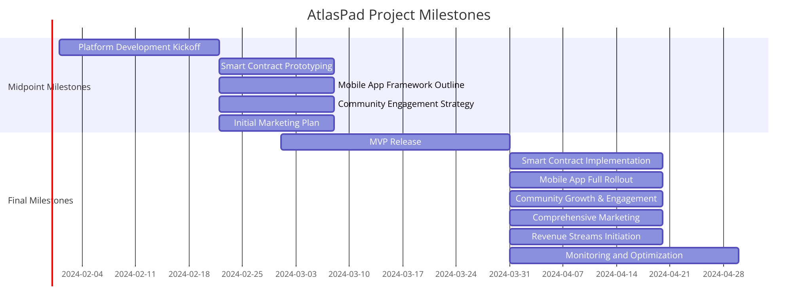

# 🛣 Milestones of "Atlaspad"

<figure><figcaption>
Figure: Milestones
</figcaption></figure>

#### <mark style="background-color:purple;">Advanced Scope Milestones</mark>

_Final Milestones (Within Three Months):_

<mark style="color:purple;">**1. MVP Platform Launch:**</mark>

\- Release the Minimum Viable Product (MVP) with essential features.\
\- Collect user feedback for improvements.\

<mark style="color:purple;">**2. Smart Contract Development:**</mark>

\- Complete robust smart contract implementation for secure transactions.\
\- Perform security audits for vulnerability checks.\

<mark style="color:purple;">**3. Mobile App Full Rollout:**</mark>

\- Launch the complete AtlasPad mobile app.\
\- Ensure cross-platform compatibility.\

<mark style="color:purple;">**4. Chatbot Integration:**</mark>

\- Develop and integrate an AI chatbot for enhanced user support.\

<mark style="color:purple;">**5. NFT Marketplace Creation:**</mark>

\- Establish a dedicated NFT marketplace.

<mark style="color:purple;">**6. Community Growth:**</mark>

\- Scale community engagement and social media presence.\
\- Implement feedback mechanisms.\

<mark style="color:purple;">**7. Marketing Campaign:**</mark>

\- Launch a comprehensive marketing campaign.\
\- Leverage partnerships and influencers.\

<mark style="color:purple;">**8. Revenue Initiatives:**</mark>

\- Implement income-generating features.\

<mark style="color:purple;">**9. Monitoring and Improvement:**</mark>

\- Implement monitoring tools.\
\- Iterate based on user feedback and market dynamics.

_These final milestones include AI chatbot development, NFT marketplace creation, and mobile app optimization to enhance AtlasPad's functionality and user experience._
