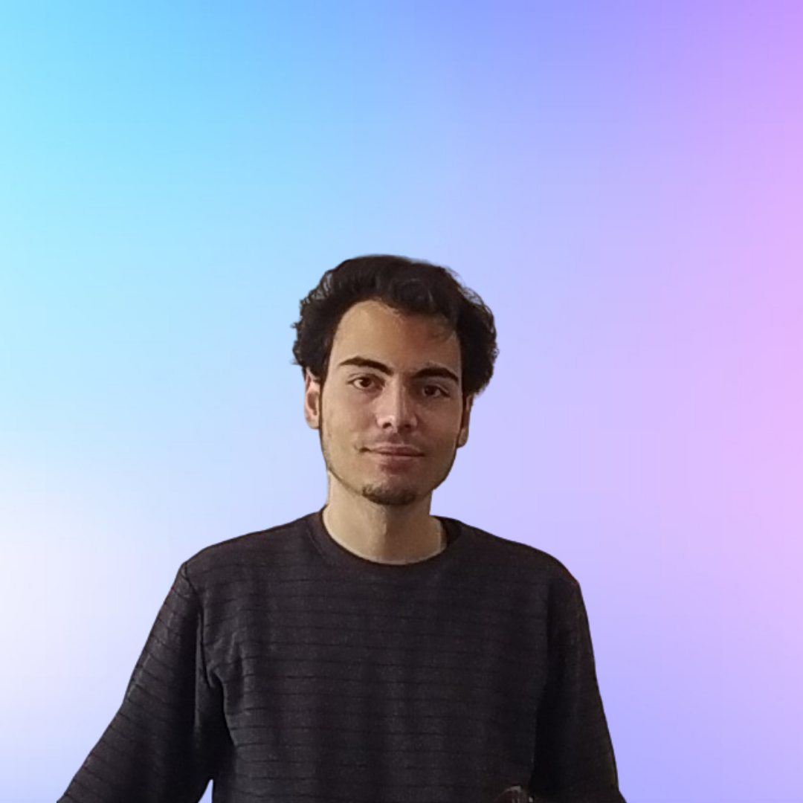

# 👥 Team of the "Atlaspad"

## Core Members

### Çağlar Fırat | CEO

<figure class=right><figcaption>
Çağlar Fırat
</figcaption></figure>

- Active in the crypto sector since 2019. 

_As of 2023 September, he is one of the founders of Atlaspad. Çağlar, in his role as Head of Com & BD at Dappad, played a pivotal role in shaping the project's communication strategy and facilitating the establishment of its community._

**Communication Skills:** Caglar has a strong ability to identify and implement communication strategies. He has increased the success of projects by communicating effectively with investors, community members and business partners. In particular, he is recognized for his ability to clearly and effectively communicate the project vision. Through both written and verbal communication skills, he has built strong relationships among stakeholders and contributed to the achievement of project objectives.

**Community Management:** Provided leadership in community management for major launchpad projects. With the ability to effectively manage and communicate effectively with communities, he contributed to the expansion of projects and the growth of communities. By understanding the needs of community members, he has been successful in securing their support and ensuring community adoption of projects.

**Business Development:** Caglar has a significant track record in securing financial support for projects by organizing VC meetings. He has also established strategic business partnerships to contribute to the growth of projects. He is an effective strategist in assessing opportunities in the business world and ensuring the growth of projects.

**Marketing Strategies:** He has developed successful marketing strategies by understanding regional differences and focusing on market needs. Using cold marketing methods, he has contributed to the adoption of projects in different regions such as Turkey, Arab, Russia and China. He is an expert in accurately defining the target audience and developing strategies to engage them.

**Leadership:** Mr. Çağlar has successfully worked in leadership roles such as communications director and vice president. He has led and guided the team to success in managing the team and realizing the vision of the projects. He is a senior leader in terms of decision-making competence, motivating and bringing the team together.

• LinkedIn: [https://www.linkedin.com/in/cfirat/](https://www.linkedin.com/in/cfirat/)

• GitHub: [https://github.com/cfirat24](https://github.com/cfirat24)

### Baturalp Güvenç | CTO

<figure class=right><figcaption>
Baturalp Güvenç
</figcaption></figure>

**Graduated Department:** Computer Engineering on 2018 \

#### Skills:

- **React:** `Next.js` \
- **Node.js:** `Express.js` \
- **Typescript** \
- **Smart Contracts:** `Solidity, OpenZeppelin` \
- **Data fetching:** `Query` \
- **API:** `GraphQL, OpenAPI` \
- **Authentication:** `Oauth2, Auth0, Web3, Merkle Trees` \
- **Cloud:** `Firebase, AWS` \
- **Style:** `wagmi, three.js, styled-components, tailwind.css, Sass/scss` \
- **ORM:** `Prisma Testing:Jest, Cypress, Integration:Infura, Stripe, Google, Youtube, GPT, Git` \
- **UI:** `Figma, Spline, Dora` \
- **Web3:** `EVM, Ceramic Network, Avalanche C Scroll, HAQQ, Moralis, APTOS, Sui, BNBchain, Goerli, Sepolia, Ganache, Hardhat, Berkeley` \
- **Provider:** `Rainbow-Kit, Metamask-SDK, Ethers.js, Web3.js` \
- **ZkApps:** `o1js, ZoKrates` \
- **Work with (Experience):** `Scroll / DATS / Cheeseart / Simurglabs / Islamic Coin / Solana / Hyperledger / Sittaris` \
- **Representative:** `Hyperledger, Solana Allstars, Aleo` \

• LinkedIn: [https://www.linkedin.com/in/baturalpguvenc/](https://www.linkedin.com/in/baturalpguvenc/)\
• Old GitHub (broken): [https://github.com/baturalpguvenc ](https://drive.google.com/file/d/1d7OUKvGZulWpJcqrspK7gN7f8gqVqEOG/view?usp=drive\_link)\
• New GitHub: [https://github.com/virijlakrum](https://github.com/virjilakrum)

### Sena Atay | CMO

<figure class=right><figcaption>
Sena Atay
</figcaption></figure>

She graduated from Bilkent University, Computer Technology and Information Systems.  `, , , `.
_She is active in crypto world since 2021 and she worked as a community & marketing manager. She is recognised as a successful female executive in the industry. She also interests in mining and rig setup. She set up her own rig system and mined for a long time. Additionaly, she loves to investigate new projects and make investments to them._

#### Skills:
- **Software:** `C++, C#` \
- **Java**
- **Web:** `.NET` \

  

• LinkedIn: [https://www.linkedin.com/in/ataysena/](https://www.linkedin.com/in/ataysena/)

### Yunus Emre Yoldaş | Backend & Smartcontract Developer

<figure class=right><figcaption>
Yunus Emre Yoldaş
</figcaption></figure>

_Emre, at the age of 13, ventured into the world of computers, initially introduced to it by friends as a means to play games. For the first five years, he regarded computers merely as a source of entertainment. However, later on, the creative potential within this realm steered him towards programming. While exploring the Android community,_
\

_Emre gained insights into the inner workings of mobile phones, with a particular fascination for the kernel. This fascination prompted a shift in his perception of computers, leading him to transition to the_ `Linux` _ecosystem. The extensive possibilities it offered to developers, coupled with its ease of configuration, opened up new horizons in programming for him. In the initial months, Emre rapidly acquired proficiency in programming languages like_ `C and C++`_. Challenges such as the lack of notifications for grade announcements from his university's automation system led him to delve into web scraping using_ `Selenium and Python`_. He later optimized this process to use pure requests instead of emulating a browser window._ \
\
_Emre also developed practical tools to simplify his daily life. A chance encounter with colleagues during a random university event led Emre to join their community, which eventually became the foundation of their group. Within this group, his primary role has been to provide clients with web2/3 websites, all while standing out in the blockchain and cryptography domain through the use of_ `TypeScript.`

#### Skills:
- **React:** `Next.js, Nuxt.js, Vue.js` \
- **Node.js** \
- **Typescript** \
- **Smart Contracts:** `Solidity, OpenZeppelin` \
- **Operating Systems** \
- **Authentication:** `Oauth2, Merkle Trees` \
- **Cloud:** `Firebase, AWS` \
- **Container:** `Docker` \
- **Style:** `wagmi, Css, tailwind.css, Sass/scss` \
- **Integration:** `Infura, Google, Youtube, GPT, Git` \
- **UI:** `Figma` \
- **Web3:** `EVM, HAQQ, Goerli, Sepolia, Ganache, Hardhat, Berkeley` \
- **Provider:** `Rainbow-Kit, Metamask-SDK, Ethers.js, Web3.js` \
- **ZkApps:** `o1js` \

• LinkedIn: [https://www.linkedin.com/in/yunus-emre-yolda%C5%9F/](https://www.linkedin.com/in/yunus-emre-yolda%C5%9F/)\
• GitHub: [https://github.com/gAtrium](https://github.com/gAtrium)\

### Yiğid Balaban | Frontend & UI/UX Developer;

<figure class=right><figcaption>
Yiğid Balaban
</figcaption></figure>

Yiğid BALABAN is a 3rd year student at Uludag University, majoring in Computer Engineering. He is also the founder of [arbeit studio](https://arbeit.studio) and [Uludag Technology and Philosophy Community](https://instagram.com/uludagtft). His first interaction with computers was back when he was 4, and from that age, his curiosity and admirance against technology only developed further.

Some keypoints:

- Designing and developing desktop applications, websites, and information systems since 2019, he has leveraged his technical expertise in blockchain-related projects. He has also taken the lead in several university teams at hackathons and competitions, collaborating with four distinct technical student communities.
- Proficient in `JavaScript/TypeScript`, `HTML`, `CSS`, and `SCSS`. Actively developing [The Genesis Framework](https://git.arbeit.studio/genesis), a front-end framework that is utilized by several different websites.
- Has a strong command of programming languages such as `C#`, `C`, `Dart`, and `Python`, adapting these skills to blockchain development. His experience extends to version control systems like `Git/GitHub` and various project development methodologies, ensuring a well-rounded approach to blockchain technology.

• **Website:** [https://fybx.dev](https://fybx.dev) \
• **LinkedIn:** [https://www.linkedin.com/in/fybx](https://www.linkedin.com/in/fybx) \
• **GitHub:** [https://github.com/fybx](https://github.com/fybx)

### Osman Nuri Yıldız | Full-stack Developer

<figure class=right><figcaption>
Osman Nuri Yıldız
</figcaption></figure>

_Full-stack web, mobile and Blockchain developer. Graduated from Computer Engineering in (2023)._ \

_Presently working as a web and mobile developer remotely in iyiMakina, an Istanbul-based startup building an innovative online marketplace.Concurrently pursuing a master's degree in Business Administration (MBA). Active member of Cuberium, a Blockchain developer team. Participated in various Web3 events and hackathons, including Devconnect 2023, Istanbul Blockchain Week, and Solana Allstars meetings. Has extensive experience in technologies such as_ `JavaScript, TypeScript, React, React Native, Linux, Git, and Docker`_. Additionally, has foundational experience in EVM-compatible smart contract development._

#### Skills:

- **React:** `Next.js, Nuxt.js, Vue.js`
- **Node.js:** `Express.js`
- **Typescript**
- **Smart Contracts:** `Solidity, OpenZeppelin`
- **API:** `GraphQL`
- **Authentication:** `Oauth2, Red-black Trees`
- **Cloud:** `Firebase, AWS`
- **Container:** `Docker Compose`
- **Style:** `wagmi, Css, Less, tailwind.css, Sass/scss`
- **ORM:** `Prisma`
- **Integration:** `Infura, Moralis, Google, Youtube, GPT, Git`
- **UI:** `Figma`
- **Web3:** `EVM, HAQQ, Goerli, Sepolia, Ganache, Hardhat, Berkeley`
- **Provider:** `Rainbow-Kit, Metamask-SDK, Ethers.js, Web3.js`
- **ZkApps:** `o1js, ZoKrates`
- **Work with (Experience):** `İyi Makine, Cuberium Security Representative: Hyperledger Foundation`

• LinkedIn: [https://www.linkedin.com/in/osmannyildiz/](https://www.linkedin.com/in/osmannyildiz/)\
• GitHub: [https://github.com/osmannyildiz](https://github.com/osmannyildiz)

### Berk Çiçek | Smart Contract Developer

<figure class=right><figcaption>
Berk Çiçek
</figcaption></figure>

_Web security, blockchain researcher, smart contract developer, backend developer, ZK researcher. As of 2021, Berk is a third-year computer engineering student at Bülent Ecevit University._

_In 2022, he became a student at Siber Vatan where he received training in cybersecurity, network, and web security. In the same year, through a startup competition, he began researching the benefits of blockchain in cybersecurity. In July 2023, with the support of the Ministry of Industry and Technology Digital Transformation Office, Berk founded Cuberium, Turkey's first blockchain team, within Siber Vatan. With the Cuberium team, he conducted training and studies on blockchain architecture and smart contracts. Together with the team, Berk established their own blockchain education platform, cublab.org In 2024, he started working as a contract developer at AtlasPad, continuing to improve himself in `ZK (Zero-Knowledge)` technology. Additionally, Berk is medium level developer in `TypeScript and o1js`, further enhancing his capabilities in the field of blockchain technology and development._

#### Skills:

- **Javascript**\
- **Web:** `HTML` \
- **Smart Contracts:** `Solidity, OpenZeppelin`\
- **Container:** `Docker Compose` \
- **Style:** `wagmi, Css` \
- **Integration:** `Infura, Moralis, GPT` \
- **UI:** `Figma` \
- **Web3:** `EVM, HAQQ, Goerli, Ganache, Hardhat` \
- **Provider:** `Metamask-SDK, Ethers.js, Web3.js` \
- **ZkApps:** `o1js` \
- **Work with Experience:** `Serim Software Solutions, Cuberium Security` \
- **Representative:** `Hyperledger Foundation` \

• LinkedIn: [https://www.linkedin.com/in/berk%C4%B1cekk/](https://www.linkedin.com/in/berk%C4%B1cekk/)\
• GitHub: [https://github.com/berkcicekk](https://github.com/berkcicekk)

## Team Members

### Muhammed Akıncı

<figure class=right><figcaption>
Muhammed Akıncı
</figcaption></figure>

**Department:** _Software Engineering._ \
**Active AI Developer:** _Cuberium_ \
**Public Sector:** _Artificial Intelligence and Blockchain developer of the Siber Vatan Blockchain Team (Cuberium Sec.) established by the TR Digital Transformation Office and the TR Ministry of Technology and Industry_\
**Languages:** _Turkish, Arabic, English_

#### Skills

- **LLM & AI:** `(Python: Mathplotlib, Django, Numpy, BeautfiulSoup, Tensorflow)` \
- **Application:** `(C, C++, C#)` \
- **Web:** `(HTML, PHP)` \
- **Javascript Framework:** `(React.js)` \
- **API:** `(OpenAPI, OpenAI, Google, Kafka)` \
- **Style:** `(CSS, SCSS)` \
- **Integration:** `(GPT, API)`\
- **UI:** `(Figma, Canva)` \
- **Web3:** `(EVM, Hyperledger Fabric)` \
- **Provider:** `(Metamask-SDK, Ethers.js)` \
- **Work with (Experience):** `Cuberium / Islamic Coin / Solana / Hyperledger Fabric` \
- **Representative:** `Hyperledger Foundation, Solana Allstars Ankara`

• LinkedIn: [https://www.linkedin.com/in/muhammedakinci/](https://www.linkedin.com/in/muhammedakinci/)\
• GitHub: [https://github.com/MuhammedAkinci](https://github.com/MuhammedAkinci)

### Mehmet Hayırlı

<figure class=right><figcaption>
Mehmet Hayırlı
</figcaption></figure>

**Department:** _Software Engineering._ \
**Active SmartContract Developer:** _Cuberium_ \
**Public Sector:** _He is the founder of the Siber Vatan Blockchain Team (Cuberium Sec.) established by the Republic of TR Digital Transformation Office and the Ministry of Technology and Indusrty of TR._ \

#### Skills:
- **React:** `(Next.js)` \
- **Smart Contracts:** `(Solidity, OpenZeppelin)` \
- **Authentication:** `(Web3)` \
- **UI:** `(Figma)` \
- **Web3:** `(EVM, Goerli, Sepolia, Ganache, Hardhat)` \
- **Provider:** `(Metamask-SDK, Ether.js, Web3.js)` \
- **ZkApps:** `(MINA Protocol, Basic o1js)` \
- **Work with (Experience):** `(Cuberium / Solana / Hyperledger Foundation)` \
- **Representative:** `(Hyperledger Foundation, Solana Allstars)`

• LinkedIn: [https://www.linkedin.com/in/mehmethayirli](https://www.linkedin.com/in/mehmethayirli)\
• GitHub: [https://github.com/mehmethayirli](https://github.com/mehmethayirli)
